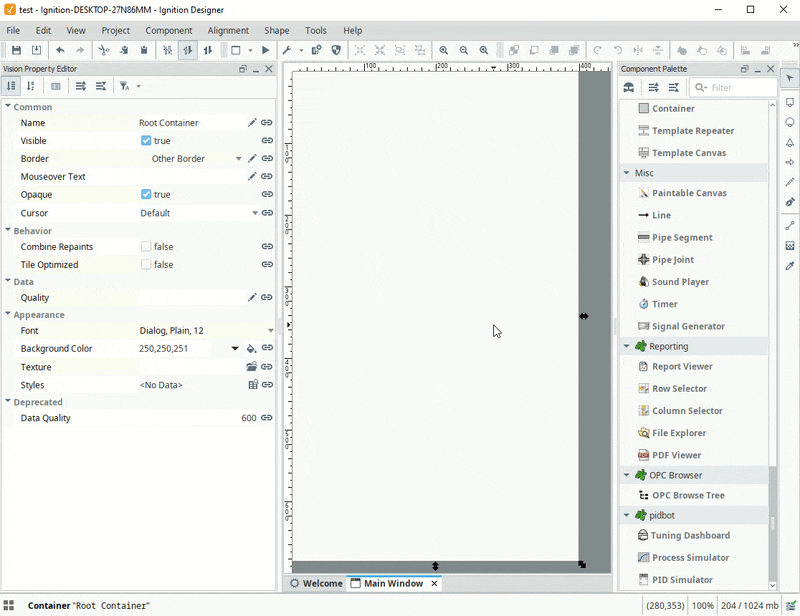

## Vision Client OPC Browser Module
An OPC Browse Tree component for Ignition's Vision module.

## Features
* Browse OPC Servers connected to your Ignition Gateway
* Extension function to customize tree node rendering
* Drag & Drop

## Demo
  
*Simple demo in the Ignition Desinger*

  
*Custom rendering, and drag/drop UDT instance creation. See [Pidbot Manager](https://github.com/jlbcontrols/pidbot-manager) project for example source.*

## Required Software  
* Ignition v8

## Setup  
* Download the .modl file: navigate to [releases](https://github.com/jlbcontrols/vision-client-opc-browser/releases), click assets, then click on the .modl file.
* Install the module on your Ignition v8 gateway following Ignition's [module installation instructions](https://docs.inductiveautomation.com/display/DOC80/Installing+or+Upgrading+a+Module).
